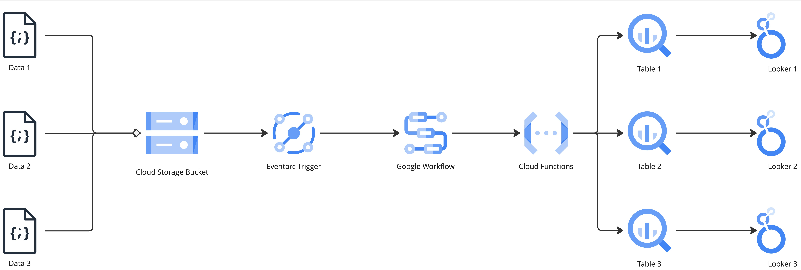

# Trumid Reverse Interview Follow Up

Follow up to discuss in a tad greater detail my suggestions for future work at Trumid.


## Development of Iterative Programmatic Process to Enable Insights from Build Data

Objective of this section is to detail a two pronged approach to both the collection of data for the purpose of improving upon internal process within Trumid, and then for the execution of improvements guided by this data. From our talk this past week there is both a desire to improve current usage of already stored data within Trumid, and also potentially allow for an ETL process which could be reused to collect and store data. My suggestion for this overall process involves an internal audit of data and the construction of an ETL like process to collect product analytics data.


### Plans for an Internal Audit

This plan revolves around the idea of conducting both a Stakeholder Interview as well as a data discovery process. The latter will be apart of the former. The former will also inform the latter as the investigation to provide end users with valuable data is undertaken. I've gone ahead and placed the suggested Stakeholder Interview Process below so the team can get an idea of what I am suggesting.

##### Objectives of This Process can be seen with the below
- Increase collaboration between the SRE and DevOps team with the creation of a core data engineering project aimed at the defining, and usage of stored infrastructure data which originates from deployments
- Development of Common Artifacts between teams to ensure that current efforts can be iterated onto the next, and can easily be stood up again for similar processes
- Standardization will allow for ease of communication of timelines, expected outcome, business value, and expected finish to both business leaders and individual contributors

Process Plan:  
1. Plan Stakeholder Interview Process  
    * Select individuals to conduct internal interviews with  
    * Clarify the objectives and overall process to interviewees days before with sample questions  
            - To basically just give time for the interview candidates to prepare with the questions
    * Customize the interview process based on the stakeholders that have been chosen to be interviewed here  

2. Start Stakeholder Interview Process
    * Break ice and dig deep to better understand the actual realties of where we are, but more importantly where we would like to be  
    * Interview stakeholders who are both guardians of the data, and also possibly the downstream consumers of the data  
    * Earn trust and buy in from the stakeholders by ensuring that their voice is heard during the course of the Interview Process, and generation of further downstream documentation

3. Review Stakeholder Interviews
    * Distill information gathered from stakeholder interview process into phases that can be monitored, tracked, and reported on during the course of the project  
    * Review and determine check in cadence with actual project stakeholders  
    * Establish project timeline  

4. Data Discovery
    * From the prior stakeholder interviews there will have been several locations listed 

5. Align Data Discovery with Team
    * Review the findings with the team to ensure that the data found within the system whether it be structured or unstructured has the ability to positively impact the team as defined from the Stakeholder interview process of this project  
    * If data found does not meet the requirements of the team, then iterate back to point 4 and repeat 5 up until the requirements are satisfied  

6. Start Build of Solution
    * Work will be started according to the principles stated at Trumid. In this case either with the use of pre-existing common artifacts, or the development of common artifacts so that future builds can take place for the proposed solution to be re-used  
    * Work will take place with two week working periods with updates provided to all stakeholders at the end of each working sprint and ceremonies throughout   


7. Deploy Solution
    * Deploy solution through each environment present within Trumid. Assuming a DEV, UAT and PROD levels here  

8. Iterate and revisit as the requirements of the project might change as new discoveries about the data are made
    * Situations change often and frequently in development. The objective here is to keep lines open on this process in order to ensure the ability to either pivot to the collection of new sources of data, or change  inputs into a visualization  


### Build of ETL Process for Collection and Distribution of Data



Please note that this entire process would be planned to be stored within a repository written in Terraform for the purpose of ensuring it can be easily deployed to the required environments. In the case of the above the cloud environment in this case would be Google Cloud Platform.

The thought here is to introduce an entirely new process that could be provisioned within GCP rather quickly, and extensible to differing types of inputs. Inputs here being defined as various data files being sent into Cloud Storage Bucket. The workflow would be potentially designed as the following.

1. Raw Input Files delivered in JSON Format  
    * Work with upstream data providers to design data drops into the specified Cloud storage bucket  
    * Establish both naming policies on the file, and then also expected schema/ keys of the incoming dataset  
    * Establish delivery cadence

2. Cloud Storage Bucket
    * Set retention policy on the bucket so only files that are over 180 days can be deleted from the actual bucket  
    * Think abut the potential of creating various file paths within the bucket for incoming files for greater organization  

3. Eventarc Trigger
    * Create an Eventarc trigger that connects the Cloud Storage bucket to the Workflows event receiver  

4. Cloud Workflow
    * Creation of Various required cloud functions that are able to extract, transform, and load data into the desired tables  
    * Set table names similarly to the incoming file names so that file value can dictate the name of the load  

5. BigQuery Tables
    * Creation of BQ tables that align with the incoming/ expected schema/ keys  

6. Looker Dashboards
    * Looker Visualizations created based on Stakeholder interviews with downstream data consumers  


Other Notes:
    Experiment with the idea of using For_each loop for resource creation from a variable within Terraform. Idea here would be to simplify the creation of new data ingestion processes by making it more or less data driven. Similar to the point that Aviv brought up with the simplification of the process to deploy endpoints dynamically based on submissions to the code base. Only once change will need to be handled here and that is simply the addition of a variable to the terraform variable code.


## Resource Utilization and Monitoring within GCP

Monitoring and logging are crucial for running reliable applications in the cloud. BigQuery workloads are no exception, especially if your workload has high volumes or is mission critical. For the purposes of this work I think we could focus on the use of Metrics for BigQuery through Cloud Monitoring, and also the usage of Billing for the purpose of setting up altering/ quotas for given projects.


Cloud Alerts/ Quotas:
1. Go to Quotas within the IAM and Admin
2. BigQuery API usage for project
3. Set limit to amount of data being processed in tibabyets
4. Restrict the number of bytes billed. Can be done on the user/ project level

Cloud Billing Export  
[Instructions to export cloud billing data to BigQuery](https://cloud.google.com/billing/docs/how-to/export-data-bigquery-setup)

User Monitoring from Information Schema:
1. Some type of query that is pushed into a view or a routine that runs on some scheduled time
```sql
SELECT 
      project_id,
      user_email,
      SPLIT(user_email, '@')[OFFSET(0)] AS Name,
      job_id,
      DateTime(creation_time) AS Date_Time,
      job_type,
      statement_type,
      priority,
      query,
      state,
      total_bytes_processed,
      total_bytes_billed,
      (total_bytes_processed / 1000000000) AS Processed_GB,
      (total_bytes_billed / 1000000000) AS Billed_GB,
      ((total_bytes_billed / 1000000000000) * 5) AS Cost
FROM region-us.INFORMATION_SCHEMA.JOBS 
WHERE 
    Date(creation_time) >= '2023-03-01'
ORDER BY creation_time DESC, total_bytes_billed DESC
```

2. Create a connection into in BigQuery into Google Data Studio/ Looker
3. Generate Dashboard to visualize cost and user data


Column definitions:  
project_id: the ID of the project in which the job was executed.  
user_email: the email address of the user who executed the job.  
Name: the name of the user who executed the job, extracted from their email address. The SPLIT function is used to split the user email address and retrieve only the user’s name.  
job_id: the ID of the job.  
Date_Time: the date and time when the job was created.  
job_type: the type of the job (e.g. query, load, export).  
statement_type: the type of SQL statement executed by the job (e.g. SELECT, INSERT, UPDATE).  
priority: the priority level of the job.  
query: the SQL query executed by the job.  
state: the current state of the job (e.g. PENDING, RUNNING, DONE).  
total_bytes_processed: the total amount of data processed by the job, in bytes.  
total_bytes_billed: the total amount of data billed for the job, in bytes.  
Processed_GB: the total amount of data processed by the job, in gigabytes (GB).  
Billed_GB: the total amount of data billed for the job, in gigabytes (GB).  
Cost: the estimated cost of the job, based on the amount of data billed and a flat rate of $5. (total_bytes_billed / 1000000000000) * 5. This formula converts the total_bytes_billed value from bytes to terabytes, and multiplies it by 5 to calculate the estimated cost. Since BigQuery costs around $5 per Terabyte of data processed  
